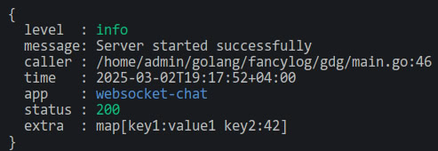

# fancylog
**fancylog** — is a package for creating beautiful, structured, and colored logs in Go. It allows you to easily format the output with support for customizable field highlighting, automatic alignment, and control over the order of data display.
___
With [Go's module support](https://go.dev/wiki/Modules#how-to-use-modules), go `[build|run|test]` automatically fetches the necessary dependencies when you add the import in your code:
```
import "github.com/HARB1I/fancylog"
```
Alternatively, use `go get`:
```
go get -u github.com/HARB1I/fancylog
```
## **Running fancylog**
installing dependencies:
```
go get github.com/rs/zerolog
go get github.com/HARB1I/fancylog
```
A basic example:

```golang
package main

import (
	"io"
	"os"
	"time"

	"github.com/rs/zerolog"

	"github.com/HARB1I/fancylog"
)

func main() {
	config := fancylog.Config{
		FieldOrder: []string{"level", "message", "caller", "time", "app", "status"},
		Rules: map[string]fancylog.ColorRule{
			"level": {
				DefaultColor: fancylog.ColorWhite,
				ValueColors: map[string]string{
					"debug": fancylog.ColorCyan,
					"info":  fancylog.ColorGreen,
					"warn":  fancylog.ColorYellow,
					"error": fancylog.ColorRed,
					"fatal": fancylog.ColorMagenta,
				},
			},
			"status": {
				DefaultColor: fancylog.ColorWhite,
				ValueColors: map[string]string{
					"200": fancylog.ColorGreen,
					"404": fancylog.ColorOrange,
					"500": fancylog.ColorRed,
				},
			},
			"app": {
				DefaultColor: fancylog.ColorBlue,
			},
		},
	}

	reader, writer := io.Pipe()
	go fancylog.Format(reader, os.Stdout, config)

	logger := zerolog.New(writer).With().Timestamp().Caller().Str("app", "websocket-chat").Logger()

	logger.Info().Int("status", 200).Str("message", "Server started successfully")
		.Timestamp().Dict("extra", zerolog.Dict()
		.Str("key1", "value1").Int("key2", 42)).Send()

	time.Sleep(2 * time.Second)
	writer.Close()
}
```
Example Output:


